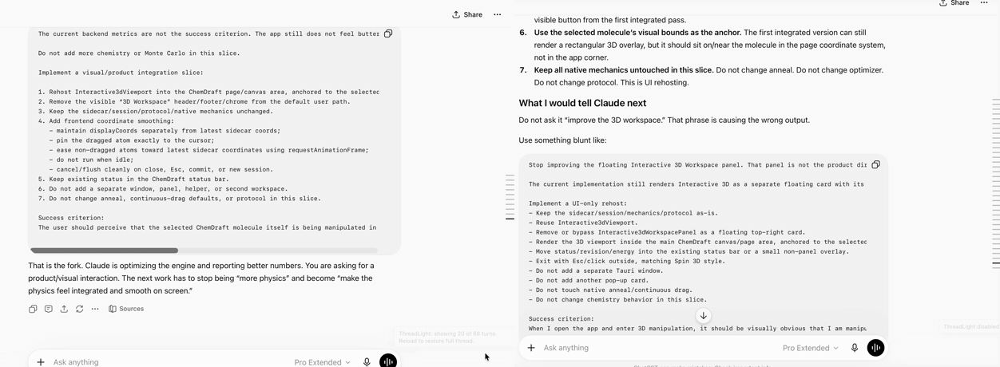

# ThreadLight

**Keep long ChatGPT threads fast in Safari.**

If you spend all day in a single long ChatGPT conversation, you've likely noticed Safari gradually slowing down — typing delays, scrolling hiccups, fans whirring louder, and the tab consuming more memory. This happens because ChatGPT renders *every* message in the thread directly on the page. After hundreds of turns, your browser is burdened with unnecessary rendering work just to display the most recent response.

ThreadLight addresses this by being a simple, local Safari extension that keeps only your latest turns visible on the page, while quietly setting older ones aside. Your entire conversation remains stored securely on ChatGPT's servers — ThreadLight never deletes any data — it simply prevents Safari from re-rendering all past messages each time you press a key.

> Unofficial project. Not affiliated with, or endorsed by, OpenAI.

## See it in action

<p align="center">
  
</p>

*The same 68-turn conversation, scrolled at the same time. **Left:** ThreadLight on — trimmed to the last 20 turns, so it's light and quick. **Right:** off — the whole thread.*

## Why you might want it

- **Long threads stay responsive.** Typing, scrolling, and streaming replies feel like a brand-new chat again, even hundreds of turns deep.
- **Lower memory and CPU.** Fewer rendered messages means far less for Safari to hold onto and repaint.
- **It gets out of your way.** No account, no sign-in, nothing to babysit. Turn it on and long threads just behave.
- **Your conversations never leave your Mac.** More on that below, because it's the whole point.

## How it works

Two mechanisms, working together:

1. **Trim on load:** When opening a conversation, ChatGPT initially downloads the full thread as JSON before displaying it. ThreadLight intercepts this response *inside your browser* and provides only the last N turns to the page, making a 300-message thread appear as a 20-message chat. This trimming process is entirely local, with the full conversation remaining unaltered on ChatGPT's servers.
2. **Prune as you go.** For messages displayed on the screen, a lightweight process periodically hides the oldest messages as the conversation grows long. It does this intentionally: it never removes the message currently streaming in real time, and it doesn't interfere with your or ChatGPT's automatic scrolling.

You control how much stays live with a slider (5–100 turns). Need the whole thing back for a minute? Hit **Restore full thread on next reload** and ThreadLight steps aside for one page load.

## The popup

Click the ThreadLight button in Safari's toolbar and you get exactly the knobs you'd expect:

- **Enable ThreadLight** — the master switch.
- **Show last _N_ turns** — how much of the conversation stays live (default 20).
- **Show status pill** — a small on-page indicator of what's currently shown.
- **Ultra lean mode** — for genuinely heavy threads: keeps fewer turns and collapses huge messages, code blocks, and media.
- **Collapse long user messages** — fold your own wall-of-text prompts behind a "show more".
- **Restore full thread on next reload** — bring everything back, just once.

Whatever you change is saved locally in the extension. There's nothing else to configure.

## Privacy

- All ThreadLight operations occur **locally on your Mac within Safari.** It examines the loaded conversation on the page to determine what to hide, then stops. At no point is your chat content transmitted elsewhere or saved to disk by ThreadLight.
- **No analytics, no telemetry, no servers, no remote config.** There is nothing for it to phone home to.
- It only runs on `chatgpt.com` and `chat.openai.com`, and asks for no other access.
- Your settings are stored locally on your machine.
- If ChatGPT sends back something ThreadLight doesn't recognize, it passes it through unchanged instead of guessing.

## Install

ThreadLight is a Safari web extension, which on macOS means it ships inside a tiny host app.

1. Download the latest **ThreadLight.dmg** from the [**Releases page**](https://github.com/jgassens/ThreadLight-GPT/releases/latest).
2. Open the DMG and drag **ThreadLight** into your Applications folder.
3. Launch ThreadLight once. It's signed and notarized by Apple, so Gatekeeper won't give you the scary warning.
4. Open **Safari → Settings → Extensions** and switch on **ThreadLight**.
5. When Safari asks, allow it to run on **chatgpt.com**.
6. Open a long conversation and enjoy the quiet.

The host app does nothing but carry the extension — once it's enabled in Safari, you can quit it. Requires a Mac running a recent version of Safari.

## Is it for you?
I dunno, try it out and see how it goes. It works best if you're active in long-running threads—like research logs, ongoing projects, or that one chat you've been updating for months. If your conversations tend to be short, you probably won't see much change.

Since this is still early software and Safari extensions can be unpredictable across different versions, please let me know if you notice anything unusual — like a thread that won't trim, a scroll that jumps, or a message that disappears unexpectedly. Share what you observed and an estimate of the thread's length. There's no need to share the actual conversation.
[Open an issue](https://github.com/jgassens/ThreadLight-GPT/issues)
## Building from source

Prefer to build it yourself?

```bash
npm install
npm run verify        # typecheck, lint, unit tests, bundle, and native-resource check
npm run sync:native   # build the extension and copy it into the Xcode project
```

Then open `native/ThreadLight/ThreadLight.xcodeproj` and run the **ThreadLight (macOS)** scheme (or use `./script/build_and_run.sh`). The extension itself is TypeScript under `extension/src/`; the native wrapper is a standard Safari-web-extension app that just hosts it.

## A note on the name

"ChatGPT" is a trademark of OpenAI. ThreadLight is an independent, unofficial tool that happens to work with ChatGPT's web interface; it's referenced here only to describe what the extension is for. If OpenAI changes how the site loads conversations, ThreadLight may need an update to keep up.
