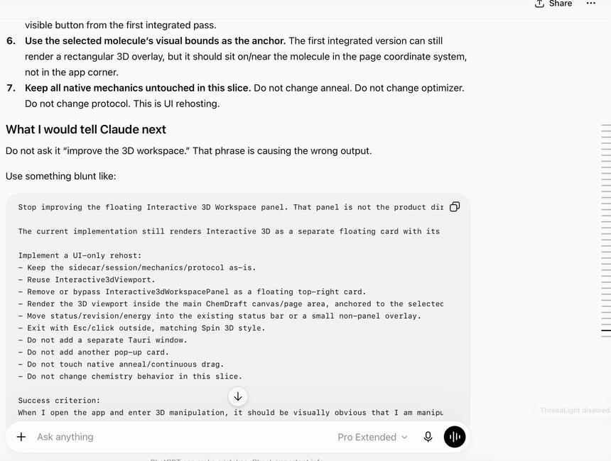

# ThreadLight

**Keep long ChatGPT threads fast in Safari.**

If you spend all day in one giant ChatGPT conversation, you've probably watched Safari slowly grind to a halt — typing lags a beat behind, scrolling stutters, the fans spin up, and the tab starts eating memory like it's a full-time job. That's because ChatGPT keeps *every* message in that thread rendered in the page. A few hundred turns of that and your browser is doing a mountain of pointless work just to show you the last thing the model said.

ThreadLight fixes that. It's a small, local-only Safari extension that keeps only your most recent turns live in the page and quietly sets the older ones aside. Your full conversation is still safe on ChatGPT's servers — ThreadLight never deletes anything — it just stops Safari from re-rendering all of it every time you press a key.

> Unofficial project. Not affiliated with, or endorsed by, OpenAI.

## See it in action

<p align="center">
  
</p>

*With ThreadLight on, a 68-turn conversation renders as just its last 20 — scrolling stays quick, and the little pill tells you exactly what's live.*

<p align="center">
  
</p>

*The same conversation with ThreadLight off: the whole thing loads, and it's a longer, heavier scroll.*

## Why you might want it

- **Long threads stay responsive.** Typing, scrolling, and streaming replies feel like a brand-new chat again, even hundreds of turns deep.
- **Lower memory and CPU.** Fewer rendered messages means far less for Safari to hold onto and repaint.
- **It gets out of your way.** No account, no sign-in, nothing to babysit. Turn it on and long threads just behave.
- **Your conversations never leave your Mac.** More on that below, because it's the whole point.

## How it works

Two mechanisms, working together:

1. **Trim on load.** When you open a conversation, ChatGPT downloads the entire thing as JSON before it draws anything. ThreadLight intercepts that response *inside your browser* and hands the page only the last N turns — so a 300-message thread renders like a 20-message one. The trimming is purely local, and the full conversation stays untouched on ChatGPT's servers.
2. **Prune as you go.** For messages that are already on screen, a lightweight pass hides the oldest ones once a thread gets long. It's deliberate about it: it never touches the reply that's currently streaming, and it won't fight your scrolling or ChatGPT's own auto-scroll.

You control how much stays live with a slider (5–100 turns). Need the whole thing back for a minute? Hit **Restore full thread on next reload** and ThreadLight steps aside for one page load.

## The popup

Click the ThreadLight button in Safari's toolbar and you get exactly the knobs you'd expect:

- **Enable ThreadLight** — the master switch.
- **Show last _N_ turns** — how much of the conversation stays live (default 20).
- **Show status pill** — a small on-page indicator of what's currently shown.
- **Ultra lean mode** — for genuinely heavy threads: keeps fewer turns and collapses huge messages, code blocks, and media.
- **Collapse long user messages** — fold your own wall-of-text prompts behind a "show more".
- **Restore full thread on next reload** — bring everything back, just once.

Whatever you change is saved locally in the extension. There's nothing else to configure.

## Privacy

This is the part I care about most, so, plainly:

- Everything ThreadLight does happens **on your Mac, inside Safari.** It looks at the conversation the page already loaded so it can decide what to hide — and that's where it ends. None of your chat content is ever sent anywhere or written to disk by ThreadLight.
- **No analytics, no telemetry, no servers, no remote config.** There is nothing for it to phone home to.
- It only runs on `chatgpt.com` and `chat.openai.com`, and asks for no other access.
- Your settings are stored locally on your machine.
- If ChatGPT sends back something ThreadLight doesn't recognize, it passes it through unchanged instead of guessing.

## Install

ThreadLight is a Safari web extension, which on macOS means it ships inside a tiny host app.

1. Download the latest **ThreadLight.dmg** from the [**Releases page**](https://github.com/jgassens/ThreadLight-GPT/releases/latest).
2. Open the DMG and drag **ThreadLight** into your Applications folder.
3. Launch ThreadLight once. It's signed and notarized by Apple, so Gatekeeper won't give you the scary warning.
4. Open **Safari → Settings → Extensions** and switch on **ThreadLight**.
5. When Safari asks, allow it to run on **chatgpt.com**.
6. Open a long conversation and enjoy the quiet.

The host app does nothing but carry the extension — once it's enabled in Safari, you can quit it. Requires a Mac running a recent version of Safari.

## Is it for you?

Honestly, try it and see. It helps most if you live in long-running threads — research logs, ongoing projects, that one chat you've been feeding for months. If your conversations are usually short, you probably won't notice much difference.

It's still early software, and Safari extensions can be quirky from one version to the next. If something feels off — a thread that won't trim, a scroll that jumps, a message that vanishes when it shouldn't — I'd really like to hear about it. [Open an issue](https://github.com/jgassens/ThreadLight-GPT/issues) with what you saw and roughly how long the thread was. You never need to share the actual conversation.

## Building from source

Prefer to build it yourself?

```bash
npm install
npm run verify        # typecheck, lint, unit tests, bundle, and native-resource check
npm run sync:native   # build the extension and copy it into the Xcode project
```

Then open `native/ThreadLight/ThreadLight.xcodeproj` and run the **ThreadLight (macOS)** scheme (or use `./script/build_and_run.sh`). The extension itself is TypeScript under `extension/src/`; the native wrapper is a standard Safari-web-extension app that just hosts it.

## A note on the name

"ChatGPT" is a trademark of OpenAI. ThreadLight is an independent, unofficial tool that happens to work with ChatGPT's web interface; it's referenced here only to describe what the extension is for. If OpenAI changes how the site loads conversations, ThreadLight may need an update to keep up.
